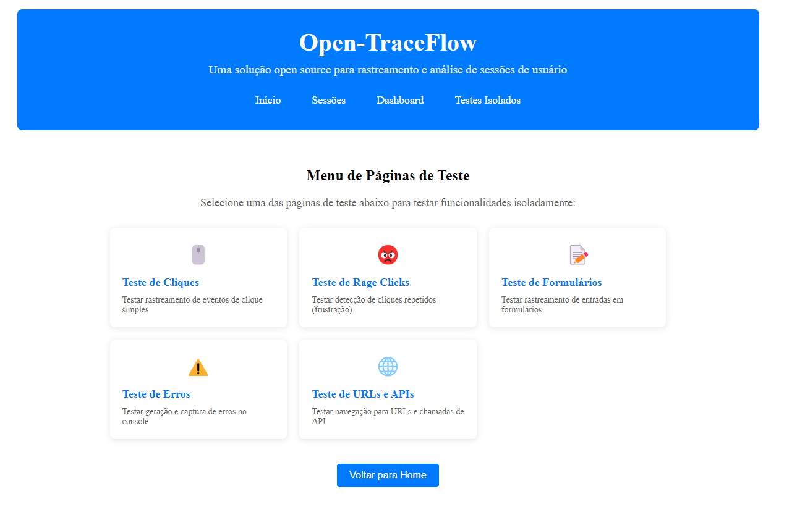

# Documentação do Projeto Open-TraceFlow

## Visão Geral

Open-TraceFlow é uma solução open source para rastreamento e análise de sessões de usuário, implementada em Angular. Esta biblioteca permite rastrear interações de usuários, gravar sessões e analisar o comportamento dos usuários em aplicações web.

## Funcionalidades Principais

1. **Rastreamento de Eventos**
   - Captura automática de eventos DOM (cliques, movimentos do mouse, rolagem, etc.)
   - Detecção de mutações no DOM
   - Suporte para eventos personalizados

2. **Detecção de Frustração do Usuário**
   - Identificação de "rage clicks" (cliques repetidos e rápidos)
   - API para reagir a eventos de frustração

3. **Gravação de Sessão**
   - Gravação completa da experiência do usuário
   - Reprodução de sessões gravadas
   - Armazenamento local de sessões

4. **Dashboard de Análise**
   - Métricas de uso e comportamento
   - Estatísticas de navegadores e dispositivos
   - Identificação de elementos mais clicados

5. **Páginas de Teste**
   - Ambiente isolado para testar funcionalidades de rastreamento
   - Testes de cliques, rage-clicks, erros e navegação
   - Simulação de chamadas API e carregamento de recursos

## Páginas de Teste

O projeto inclui um conjunto abrangente de páginas de teste que permitem verificar diferentes aspectos do rastreamento e gravação:



1. **Teste de Cliques**: Testa o rastreamento de eventos de clique simples
2. **Teste de Rage Clicks**: Testa a detecção de cliques repetidos que indicam frustração
3. **Teste de Formulários**: Testa o rastreamento de entradas em formulários
4. **Teste de Erros**: Testa a geração e captura de erros no console
5. **Teste de URLs e APIs**: Testa navegação para URLs e chamadas de API, incluindo:
   - Navegação para URLs quebradas
   - Chamadas de API com diferentes códigos de status
   - Testes de falhas de recursos (imagens, scripts, CSS)

Para acessar as páginas de teste:
1. Inicie o aplicativo (`npm start`)
2. Navegue para `/test` no navegador
3. Selecione o teste desejado no menu

```html
<!-- Exemplo de uso em uma aplicação -->
<a routerLink="/test">Acessar Testes Isolados</a>
```

## Arquitetura

O projeto está organizado em módulos Angular:

- **Core**: Módulo principal com serviços compartilhados
- **Tracking**: Módulo responsável pelo rastreamento de eventos
- **Shared**: Módulo com componentes compartilhados
- **Pages**: Contém os componentes de página, incluindo os testes isolados

### Serviços Principais

1. **EventTrackerService**: Responsável por capturar eventos do usuário
2. **RageClickDetectorService**: Detecta padrões de cliques que indicam frustração
3. **SessionRecorderService**: Grava e gerencia sessões de usuário
4. **AnalyticsService**: Processa dados para gerar métricas e insights

### Componentes

1. **SessionListComponent**: Exibe lista de sessões gravadas
2. **SessionPlayerComponent**: Reproduz sessões gravadas
3. **DashboardComponent**: Exibe métricas e análises
4. **TestMenuComponent**: Menu de navegação para os testes isolados

## Instalação

1. Adicione o módulo ao seu projeto Angular:

```bash
npm install open-traceflow --save
```

2. Importe o módulo em seu AppModule:

```typescript
import { TrackingModule } from 'open-traceflow';

@NgModule({
  imports: [
    BrowserModule,
    TrackingModule.forRoot(),
    // outros módulos
  ],
  // ...
})
export class AppModule { }
```

## Uso Básico

### Iniciar Rastreamento

```typescript
import { EventTrackerService, SessionRecorderService } from 'open-traceflow';

@Component({
  // ...
})
export class AppComponent implements OnInit {
  constructor(
    private eventTracker: EventTrackerService,
    private sessionRecorder: SessionRecorderService
  ) {}

  ngOnInit() {
    // Inicia a gravação de sessão (também inicia o rastreamento de eventos)
    this.sessionRecorder.startRecording();
  }
}
```

### Rastrear Eventos Personalizados

```typescript
this.eventTracker.trackCustomEvent('purchase_completed', {
  productId: '12345',
  price: 99.99,
  currency: 'USD'
});
```

### Detectar Rage Clicks

```typescript
import { RageClickDetectorService } from 'open-traceflow';

@Component({
  // ...
})
export class AppComponent implements OnInit {
  constructor(private rageClickDetector: RageClickDetectorService) {}

  ngOnInit() {
    // Habilita a detecção de rage clicks
    this.rageClickDetector.enable();

    // Inscreve-se para receber eventos de rage clicks
    this.rageClickDetector.getRageClicks().subscribe(event => {
      console.log('Rage click detectado:', event);
      // Implementar lógica para reagir ao rage click
    });
  }
}
```

### Exibir Dashboard de Análise

```html
<app-dashboard></app-dashboard>
```

### Exibir Lista de Sessões e Reprodutor

```html
<div class="sessions-container">
  <app-session-list></app-session-list>
  <app-session-player [session]="selectedSession"></app-session-player>
</div>
```

## Problemas Conhecidos e TODOs

### Problemas Críticos

- **[BUG CRÍTICO]** Dashboard entrando em loop infinito ao processar determinados tipos de eventos. Necessária revisão urgente do componente `DashboardComponent` e da lógica de processamento no `AnalyticsService`.

### TODOs

- Implementar sistema de armazenamento em nuvem para as sessões
- Otimizar o uso de memória durante gravações longas
- Adicionar filtros avançados para busca de sessões
- Melhorar a reprodução de eventos complexos (drag-and-drop, gestos)
- Implementar exportação de dados em formatos padrão de análise

## Considerações de Privacidade

- Por padrão, campos sensíveis (senhas, dados de cartão de crédito) são automaticamente excluídos da captura
- Use o atributo `data-fs-exclude` em elementos que não devem ser rastreados
- Implemente o consentimento do usuário antes de iniciar o rastreamento

## Limitações Atuais

- Armazenamento apenas local (não há sincronização com servidor)
- Suporte limitado para aplicações com muitas animações ou Canvas
- Reprodução simplificada de sessões (sem reconstrução completa do DOM)

## Contribuição

Contribuições são bem-vindas! Por favor, siga estas etapas:

1. Faça um fork do repositório
2. Crie uma branch para sua feature (`git checkout -b feature/amazing-feature`)
3. Faça commit das suas mudanças (`git commit -m 'Add some amazing feature'`)
4. Envie para a branch (`git push origin feature/amazing-feature`)
5. Abra um Pull Request

## Licença

Este projeto é licenciado sob a licença MIT - veja o arquivo LICENSE para detalhes.
